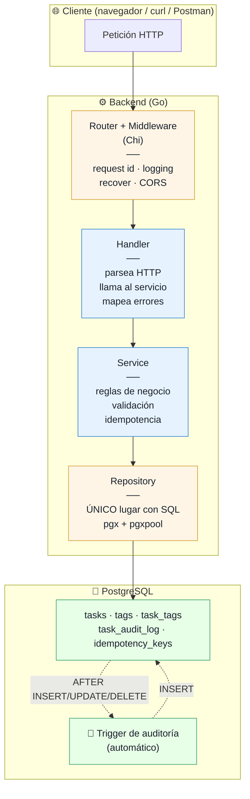
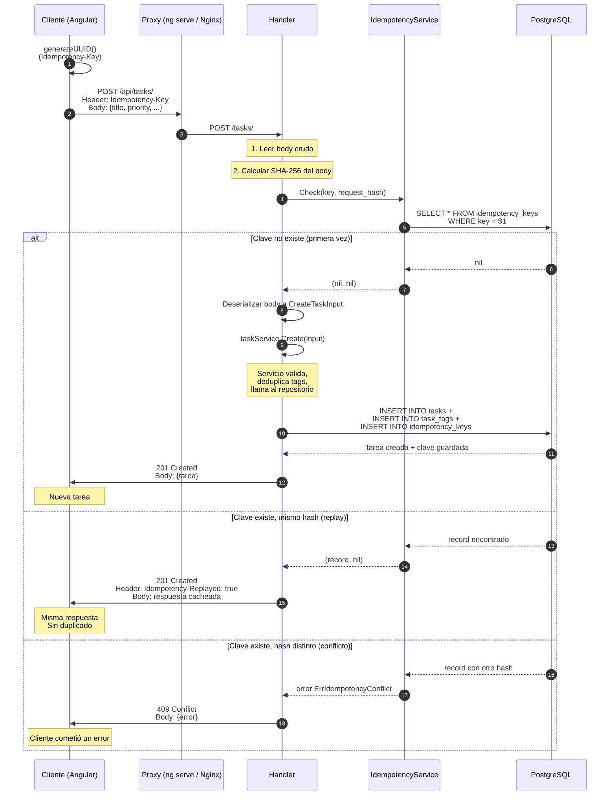
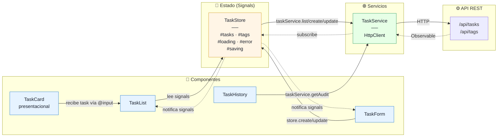
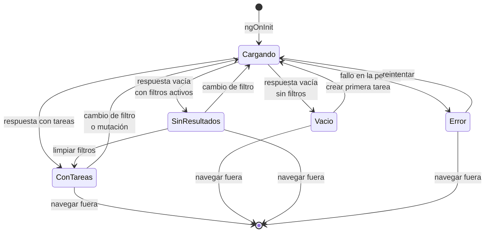
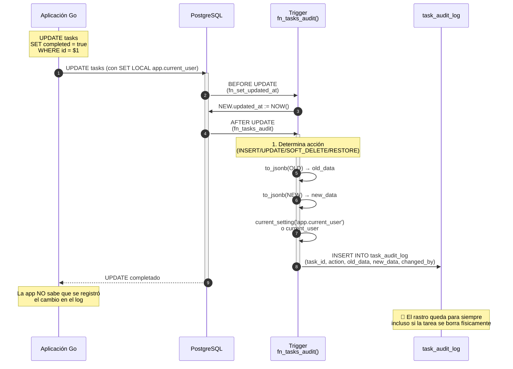
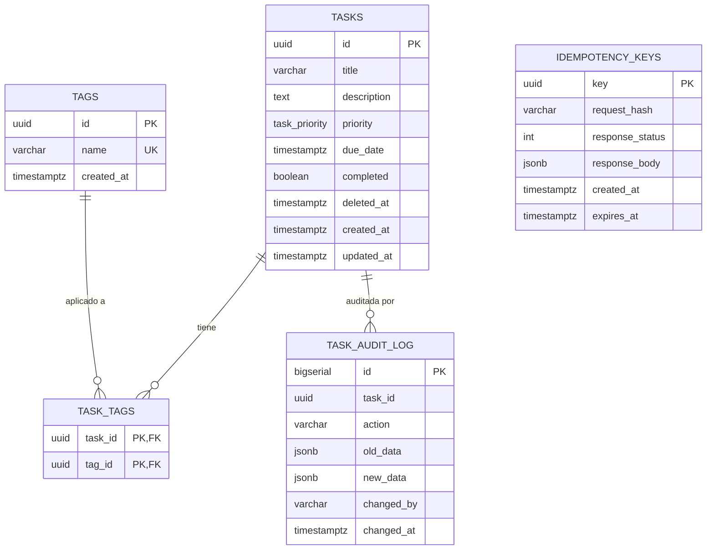

# Diagramas de arquitectura

Documentación visual de la arquitectura, flujos y modelo de datos del proyecto.

Todos los diagramas usan [Mermaid](https://mermaid.js.org/) y se renderizan automáticamente en GitHub, GitLab y VS Code con la extensión *Markdown Preview Mermaid Support*.

## Índice

1. [Arquitectura de capas del backend](#1-arquitectura-de-capas-del-backend)
2. [Secuencia HTTP de POST con idempotencia](#2-secuencia-http-de-post-con-idempotencia)
3. [Flujo de datos del frontend](#3-flujo-de-datos-del-frontend)
4. [Máquina de estados del listado](#4-máquina-de-estados-del-listado)
5. [Flujo de auditoría por trigger](#5-flujo-de-auditoría-por-trigger)
6. [Modelo entidad-relación](#6-modelo-entidad-relación)

---

## 1. Arquitectura de capas del backend

Cómo fluye una petición HTTP a través de las capas. Cada capa solo conoce a la inmediatamente inferior.

**Lectura clave**:
- El **dominio** (`Handler`, `Service`) no sabe qué es SQL ni HTTP.
- El **repositorio** es el único punto de contacto con PostgreSQL.
- El **trigger** corre dentro de la misma transacción, sin round-trips adicionales.

---

## 2. Secuencia HTTP de POST con idempotencia

El flujo más complejo del sistema: crear una tarea con protección contra duplicados.

**Puntos clave**:
- **El hash SHA-256 del body** detecta reutilización de la misma key con distinto payload.
- **La respuesta se guarda como JSON crudo** en `idempotency_keys.response_body`. Si el cliente reintenta, se devuelve tal cual.
- **El header `Idempotency-Replayed: true`** comunica al cliente que la respuesta es un replay.

---

## 3. Flujo de datos del frontend

Cómo se conectan los componentes, el store y el servicio HTTP.

**Reglas de oro**:
- Los componentes **nunca** llaman a `HttpClient` directamente. Siempre pasan por el store o el servicio.
- El store **nunca** muta el array localmente después de una operación: recarga desde el backend para mantener coherencia.
- Los componentes **solo leen signals** y llaman a métodos. Nunca escriben al estado directamente.

---

## 4. Máquina de estados del listado

Los estados visuales que puede tener la página `TaskList`.

**Decisión clave**: los estados `Vacio` y `SinResultados` se diferencian visualmente:
- **Vacio**: "No hay tareas todavía" → call to action "Crear primera tarea".
- **SinResultados**: "Sin resultados" → call to action "Limpiar filtros".

Esta distinción evita que el usuario piense que perdió sus datos cuando en realidad los filtros no coinciden.

---

## 5. Flujo de auditoría por trigger

Cómo se registra automáticamente cada cambio, sin que la aplicación Go participe.

**Puntos clave**:
- El trigger corre **dentro de la misma transacción** del `UPDATE`. Si el trigger falla, el `UPDATE` también falla. Esto es lo que garantiza la consistencia.
- El usuario se obtiene de `SET LOCAL app.current_user` si la app lo seteó. Si no, cae a `current_user` de PostgreSQL (útil para cambios manuales en pgAdmin).
- **La aplicación Go no participa**. Es imposible saltarse la auditoría desde el código.

---

## 6. Modelo entidad-relación

Estructura de datos de la aplicación.

**Detalles sutiles**:
- **`TASK_AUDIT_LOG` no tiene FK** hacia `tasks`. Es deliberado: si se borra físicamente una tarea, la auditoría sobrevive.
- **`IDEMPOTENCY_KEYS` es independiente**: no referencia a `tasks` porque su propósito es puramente técnico.
- **`TASK_TAGS` usa PK compuesta** `(task_id, tag_id)`. No puede existir la misma dupla dos veces, lo cual es una forma de idempotencia a nivel de BD.
- **`deleted_at` permite soft delete** con índice parcial.

---

## Cómo ver estos diagramas

### En VS Code

1. Instala la extensión **Markdown Preview Mermaid Support** (bierner.markdown-mermaid).
2. Abre este archivo.
3. Presiona `Ctrl+Shift+V` para ver la vista previa.

### En GitHub

GitHub renderiza Mermaid **automáticamente** en archivos `.md`. Solo tienes que abrir el archivo en el navegador.

### En la presentación

Si expones este archivo en pantalla compartida, los diagramas se ven claramente. Cada uno cuenta una parte de la historia del sistema.